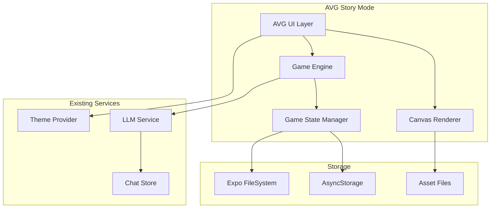

# Design Document

## Overview

AVG故事模式是一个基于React Native和Expo的移动端视觉小说游戏页面。该功能将集成到现有的SillyTavern移动应用中，提供沉浸式的AI驱动故事体验。系统采用Canvas渲染引擎处理背景图和角色立绘，结合现有的AI服务实现智能对话生成。

## Architecture

### 技术栈
- **前端框架**: React Native 0.81.4 + Expo ~54.0.8
- **路由**: Expo Router ~6.0.6
- **UI组件**: React Native Paper ^5.12.5
- **状态管理**: Zustand ^4.5.2
- **存储**: AsyncStorage + Expo FileSystem
- **渲染引擎**: React Native Canvas (通过WebView或原生Canvas实现)
- **AI服务**: 复用现有的LLM服务 (OpenAI/Claude/Gemini)

### 系统架构图



## Components and Interfaces

### 1. 核心组件结构

```typescript
// 主要组件层次结构
AVGStoryScreen
├── AVGCanvas (Canvas渲染层)
├── AVGDialogueBox (对话框UI)
├── AVGChoicePanel (选择面板)
├── AVGInputPanel (自由输入面板)
└── AVGControlPanel (控制面板)
```

### 2. Canvas渲染系统

**AVGCanvas组件**
```typescript
interface AVGCanvasProps {
  backgroundImage: string;
  characterImage?: string;
  characterPosition?: { x: number; y: number };
  onCanvasReady: () => void;
}

interface CanvasRenderer {
  loadBackground(imagePath: string): Promise<void>;
  loadCharacter(imagePath: string, position: Position): Promise<void>;
  updateCharacter(position: Position, expression?: string): void;
  clearCanvas(): void;
  resize(width: number, height: number): void;
}
```

**实现方案**: 使用react-native-canvas或WebView内嵌Canvas实现

### 3. 游戏引擎核心

**GameEngine接口**
```typescript
interface GameEngine {
  // 游戏状态管理
  initializeGame(config: GameConfig): Promise<void>;
  loadScene(sceneId: string): Promise<void>;
  
  // 对话系统
  processUserInput(input: string): Promise<AIResponse>;
  generateChoices(context: DialogueContext): Promise<Choice[]>;
  
  // 渲染控制
  updateVisuals(scene: SceneData): void;
  playDialogue(text: string, character: string): void;
}

interface GameConfig {
  characterName: string;
  userName: string;
  initialScene: string;
  systemPrompt?: string;
}
```

### 4. 状态管理

**AVG Store (Zustand)**
```typescript
interface AVGState {
  // 游戏状态
  currentScene: SceneData;
  dialogueHistory: DialogueEntry[];
  gameConfig: GameConfig;
  
  // UI状态
  isDialogueActive: boolean;
  isChoicePanelVisible: boolean;
  isInputPanelVisible: boolean;
  
  // 流式对话状态
  streamingText: string;
  isStreaming: boolean;
  
  // Actions
  setScene: (scene: SceneData) => void;
  addDialogue: (entry: DialogueEntry) => void;
  setStreamingText: (text: string) => void;
  saveGameState: () => Promise<void>;
  loadGameState: () => Promise<void>;
}
```

### 5. AI集成接口

**AVG AI Service**
```typescript
interface AVGAIService {
  generateResponse(
    context: DialogueContext,
    userInput: string
  ): Promise<{
    response: string;
    choices?: Choice[];
    sceneUpdate?: Partial<SceneData>;
  }>;
  
  streamResponse(
    context: DialogueContext,
    userInput: string,
    callbacks: StreamCallbacks
  ): Promise<void>;
}

interface DialogueContext {
  characterName: string;
  userName: string;
  systemPrompt: string;
  recentHistory: DialogueEntry[];
  currentScene: SceneData;
}
```

## Data Models

### 1. 场景数据模型

```typescript
interface SceneData {
  id: string;
  backgroundImage: string;
  character?: {
    name: string;
    image: string;
    position: Position;
    expression?: string;
  };
  ambientText?: string;
}

interface Position {
  x: number;
  y: number;
  scale?: number;
}
```

### 2. 对话数据模型

```typescript
interface DialogueEntry {
  id: string;
  timestamp: number;
  speaker: string;
  text: string;
  type: 'user' | 'character' | 'system' | 'narration';
  sceneId?: string;
}

interface Choice {
  id: string;
  text: string;
  action?: string;
  metadata?: Record<string, any>;
}
```

### 3. 游戏存档模型

```typescript
interface GameSave {
  id: string;
  title: string;
  createdAt: string;
  updatedAt: string;
  gameConfig: GameConfig;
  currentScene: SceneData;
  dialogueHistory: DialogueEntry[];
  gameVariables: Record<string, any>;
}
```

## Error Handling

### 1. 资源加载错误处理

```typescript
class AssetLoader {
  async loadImage(path: string): Promise<ImageData> {
    try {
      // 尝试加载图片
      return await this.loadImageFromPath(path);
    } catch (error) {
      // 降级到占位符图片
      console.warn(`Failed to load image: ${path}`, error);
      return this.getPlaceholderImage();
    }
  }
}
```

### 2. AI服务错误处理

```typescript
class AVGAIServiceImpl implements AVGAIService {
  async generateResponse(context: DialogueContext, userInput: string) {
    try {
      return await this.callAIService(context, userInput);
    } catch (error) {
      // 提供降级响应
      return {
        response: "抱歉，我现在无法回应。请稍后再试。",
        choices: [
          { id: "retry", text: "重试", action: "retry" },
          { id: "continue", text: "继续", action: "continue" }
        ]
      };
    }
  }
}
```

### 3. 存档系统错误处理

```typescript
class SaveManager {
  async saveGame(gameState: GameSave): Promise<boolean> {
    try {
      await this.writeToFile(gameState);
      return true;
    } catch (error) {
      // 尝试备份存储
      try {
        await this.saveToAsyncStorage(gameState);
        return true;
      } catch (backupError) {
        console.error('Failed to save game:', error, backupError);
        return false;
      }
    }
  }
}
```

## Testing Strategy

### 1. 单元测试

**测试覆盖范围**:
- GameEngine核心逻辑
- AVGStore状态管理
- AI服务集成
- 数据序列化/反序列化

**测试工具**: Jest + React Native Testing Library

```typescript
// 示例测试
describe('GameEngine', () => {
  test('should initialize game with correct config', async () => {
    const engine = new GameEngine();
    const config = { characterName: 'Test', userName: 'User', initialScene: 'scene1' };
    
    await engine.initializeGame(config);
    
    expect(engine.getCurrentConfig()).toEqual(config);
  });
});
```

### 2. 集成测试

**测试场景**:
- Canvas渲染流程
- AI对话完整流程
- 存档加载流程
- 错误恢复机制

### 3. UI测试

**测试重点**:
- 触摸交互响应
- 流式文本显示
- 选择面板交互
- 屏幕旋转适配

### 4. 性能测试

**关键指标**:
- Canvas渲染帧率 (目标: 60fps)
- 内存使用 (图片资源管理)
- AI响应时间
- 存档读写性能

## Implementation Phases

### Phase 1: 基础架构 (V0.1)
- Canvas渲染系统
- 基础UI组件
- 状态管理设置
- 路由集成

### Phase 2: 核心功能 (V0.2)
- AI服务集成
- 对话系统
- 选择分支系统
- 基础存档功能

### Phase 3: 完善体验 (V0.3)
- 流式文本动画
- 错误处理完善
- 性能优化
- 测试覆盖

### Phase 4: 扩展准备 (V1.0准备)
- 剧情推进接口预留
- 数据结构扩展
- 插件系统设计

## File Structure

```
mobile/
├── app/
│   └── avg/
│       ├── index.tsx              # AVG主页面
│       └── game/
│           └── [sessionId].tsx    # 游戏会话页面
├── components/
│   └── avg/
│       ├── AVGCanvas.tsx          # Canvas渲染组件
│       ├── AVGDialogueBox.tsx     # 对话框组件
│       ├── AVGChoicePanel.tsx     # 选择面板组件
│       ├── AVGInputPanel.tsx      # 输入面板组件
│       └── AVGControlPanel.tsx    # 控制面板组件
├── src/
│   ├── services/
│   │   ├── avg-ai.ts              # AVG AI服务
│   │   ├── avg-canvas.ts          # Canvas渲染服务
│   │   └── avg-assets.ts          # 资源管理服务
│   ├── stores/
│   │   └── avg.ts                 # AVG状态管理
│   └── types/
│       └── avg.ts                 # AVG类型定义
└── assets/
    └── avg/
        ├── image/
        │   ├── scene/
        │   │   └── test-1.png     # 背景图
        │   └── character/
        │       └── test/
        │           └── 1.png      # 角色立绘
        └── config/
            └── default-scene.json # 默认场景配置
```

## Performance Considerations

### 1. 图片资源优化
- 使用WebP格式减少文件大小
- 实现图片预加载和缓存机制
- 按需加载，避免内存溢出

### 2. Canvas渲染优化
- 使用离屏Canvas进行复杂渲染
- 实现脏矩形更新机制
- 优化重绘频率

### 3. AI服务优化
- 实现请求去重和缓存
- 优化上下文长度管理
- 实现智能重试机制

### 4. 存储优化
- 使用增量存档减少IO
- 实现存档压缩
- 定期清理过期数据